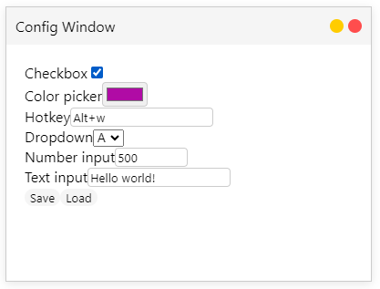
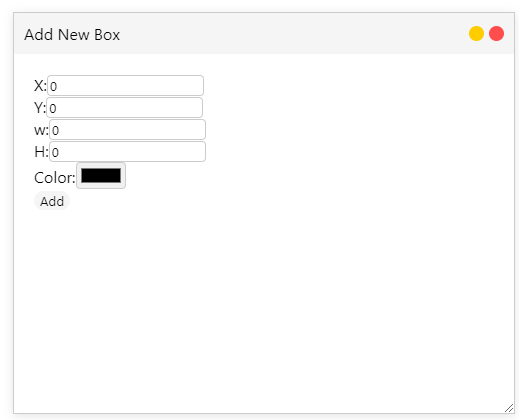

# Vasara
A little modal window UI framework in JS. See `index.html` and `demo.js` for an example usage. Screenshots from [this demo](http://www.mlml.dev/vasara/) are used in the readme
### !!! Under heavy development, expect breaking API changes and bugs !!! 

## Usage

The code can be found at `https://raw.githubusercontent.com/0mlml/vasara/main/vasara.js`

Create a new `vasara` object, for example, like this:
```js
const ui = vasara();
```

## Features

### Awesome styling

Modern styling with box shadow and rounded corners


### Configuration Management

Helper functions to manage configuration values of types: `'checkbox', 'color', 'hotkey', 'dropdown', 'number', 'text', 'hidden'`

Register, set, query configuration values with built in validation and callbacks. Also automatically generate a modal window with all of the configuration values:



### Hotkeys

Hotkeys can be registered as easily as calling `registerHotkey(combo, func)` and unregistered as easily as calling `unregisterHotkey(combo, func)`

Hotkeys use a simple syntax of `key+key+...`, e.g. `'alt+e'`

### Draggable windows

Each window can be grabbed by the header and dragged with the mouse. 

### Bring to front on click

The windows will bring themselves to the front of other modal windows when clicked.

### Close and 'ghost' Buttons on All Windows

The 'ghost' button makes the window transparent and the close button removes the window element. Both can be disabled by setting `enableGhostButton` and/or `enableCloseButton` to false


### Content Helper Functions
Awesome streamlined builder functions that can be chained, the dream of all JavaScript developers

#### For example, this:

```js
const modal = ui.generateModalWindow({ title: modalTitle, width: 500, height: 400, resizable: true, });

modal.generateLabel({ text: 'X:' }).generateNumberInput({ oninput: (e) => { box.x = e.target.value; } }).putNewline().generateLabel({ text: 'Y:' }).generateNumberInput({ oninput: (e) => { box.y = e.target.value; } }).putNewline().generateLabel({ text: 'w:' }).generateNumberInput({ oninput: (e) => { box.w = e.target.value; } }).putNewline().generateLabel({ text: 'H:' }).generateNumberInput({ oninput: (e) => { box.h = e.target.value; } }).putNewline().generateLabel({ text: 'Color:' }).generateColorInput({ oninput: (e) => { box.color = e.target.value; } }).putNewline().generateButton({ text: 'Add', onclick: () => { ['x', 'y', 'w', 'h'].forEach(v => { box[v] = parseFloat(box[v]); }); boxes.push(box); redraw(); modal.remove(); } });
```

<details>
    <summary> The same code but more elegant</summary>

```js
const modal = ui.generateModalWindow({
    title: modalTitle,
    width: 500,
    height: 400,
    resizable: true,
});

modal.generateLabel({
    text: 'X:',
}).generateNumberInput({
    oninput: (e) => { box.x = e.target.value; },
}).putNewline();

modal.generateLabel({
    text: 'Y:',
}).generateNumberInput({
    oninput: (e) => { box.y = e.target.value; },
}).putNewline();

modal.generateLabel({
    text: 'w:',
}).generateNumberInput({
    oninput: (e) => { box.w = e.target.value; },
}).putNewline();

modal.generateLabel({
    text: 'H:',
}).generateNumberInput({
    oninput: (e) => { box.h = e.target.value; },
}).putNewline();

modal.generateLabel({
    text: 'Color:',
}).generateColorInput({
    oninput: (e) => { box.color = e.target.value; },
}).putNewline();

modal.generateButton({
    text: 'Add',
    onclick: () => {
        for (const key in ['x', 'y', 'w', 'h']) {
            box[key] = parseFloat(box[key]);
        }
        boxes.push(box);
        redraw();
        modal.remove();
    },
});
```
</details>

#### Turns into this:



### Duplicate Title Stacking
Windows with the same titles will have a (number) added automatically. This can be disabled with the `disableTitleStacking` option.

You can also block duplicate windows with the `unique` flag.

